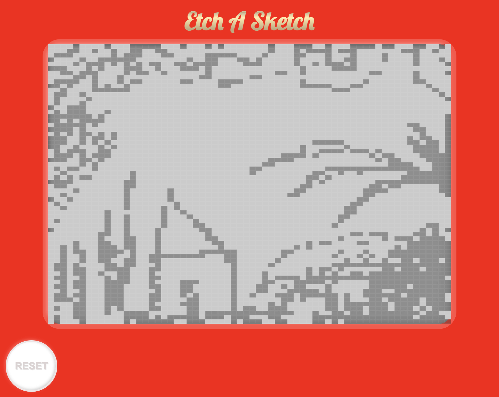

# Etch A Sketch

An Etch A Sketch toy clone made with HTML, CSS and JavaScript.

## Live Demo

[Play it here!](https://emanuelefavero.github.io/etch-a-sketch/)

#### Screenshot

## How to use locally

- Clone the repository
- Open the `index.htm`l file in your browser

> Learn more about the [Etch A Sketch toy](https://en.wikipedia.org/wiki/Etch_A_Sketch)
